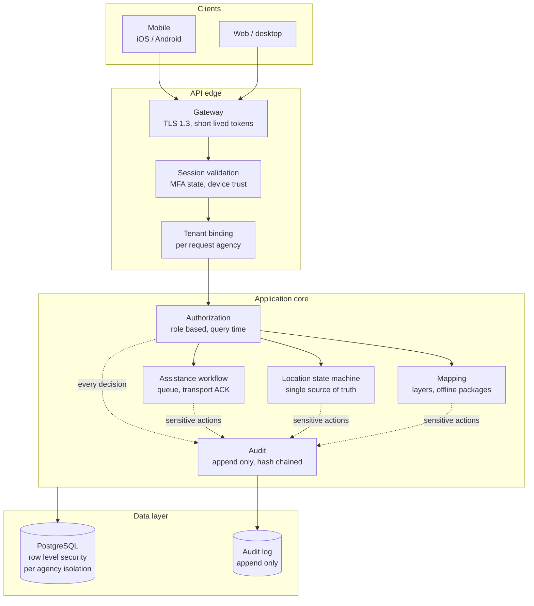

# OMEGA FIELD COMMAND

### Secure field operations and task force coordination for law enforcement.

**PROTECT. ENABLE. EMPOWER.**

A product of <b>Omega Point Solutions LLC</b> · Fraud Detection · Critical Infrastructure · Public Safety

---

## Overview

Omega Field Command coordinates officers in the field: where they are, when they need help, and who actually got the call. It is built for agencies and multi-agency task forces that need one operating picture without handing their data to a shared cloud tenant they cannot audit.

This repository is the public documentation and capability reference. The implementation is maintained privately.

## The problem it removes

Field coordination tools fail in specific, survivable-looking ways. Those failures are the design targets here.

| Failure in the field | What it costs | How Field Command answers it |
|---|---|---|
| A map shows a location that is minutes old as if it were current | Units respond to where an officer *was* | Location is a state machine with one render path. Stale is labeled stale. GPS off renders off. There is no code path that can present a stale fix as live. |
| The system says "delivered" because it handed the alert to a transport | Nobody is coming, and the requesting officer does not know | `delivered` is set only on a transport acknowledgement. Exhausted retries surface as `failed` to the requester, per recipient. |
| A supervisor can silently switch on an officer's location sharing | Trust in the tool collapses, and adoption with it | Only the device owner can transition into a sharing state. The rule is enforced in the state machine, not in a UI check. |
| One agency's bug exposes another agency's data | Task force participation ends | Isolation is enforced by the database with row level security, not by application `WHERE` clauses. |
| "Who looked at this record?" cannot be answered | The record is not defensible | Every allow, deny, and error is written to an append only, hash chained audit trail. |

## Capabilities

| Area | Capability |
|---|---|
| **Location** | Owner controlled sharing modes, computed staleness, approximate and manual pin modes, single authoritative render path |
| **Officer assistance** | One tap request, per recipient delivery state, acknowledgement and decline, mandatory disposition on resolve, full timeline |
| **Access control** | Role based access as data, evaluated per request. Revoking a role takes effect on the next request, with no token cache to wait out |
| **Multi agency** | Per agency isolation enforced at the database layer, scoped grants for units, task forces, cases, and operations |
| **Accountability** | Append only, hash chained audit of every sensitive action, with coordinates and message content scrubbed before write |
| **Mapping** | In house mapping stack built on United States government public domain data, including offline packages for degraded coverage |
| **Identity** | Mandatory multi factor authentication, hashed opaque session tokens, instant revocation and suspension, account lockout |
| **Integrations** | Typed contracts for analysis and intelligence systems. Every call carries actor and purpose, and returns citations flagged for human review |

## How it is built differently

### Isolation is structural, not conventional

Most multi tenant systems keep tenants apart with an application filter. One missed clause leaks another agency's data. Field Command binds the agency to the database session, and PostgreSQL row level security filters every query. The application cannot see another agency's rows even when the application is wrong.

### Officer safety is a correctness property

Staleness, sharing state, and delivery status are not display concerns. They are enforced invariants with tests that assert the failure cases, written before the features.

### Accountability by construction

The audit trail is a wrapper around every sensitive handler rather than a call developers remember to add. It is append only at the database layer and hash chained, so a removed row breaks the chain.

### American made by construction

No other vendor's product code ships inside this platform. The web framework, validation, authentication, multi factor authentication, mapping, tiling, and geocoder are Omega Point original work. The foundations are permissively licensed and United States origin: Python from the Python Software Foundation, PostgreSQL from Berkeley. Map data comes from United States government sources that are public domain by statute.

The production build adds exactly two dependencies, both permissively licensed and both audited into the provenance register. A build gate fails the pipeline if anything else is imported. See [American made by construction](docs/american-made.md).

## Architecture

Detail: [Architecture](docs/architecture.md) · [Security posture](docs/security-posture.md)

## Evidence, not adjectives

Security claims are worth what their proof is worth. Ours:

- **Tenant isolation is proven on every commit.** An automated test applies the real migrations to a live PostgreSQL instance and asserts that one agency cannot see or modify another's records, that an unbound session returns zero rows rather than all rows, and that the audit log rejects updates and deletes. The pipeline fails if that proof does not run.
- **The provenance rule is machine checked.** A build gate parses every product module and fails on any import outside the standard library, Omega Point packages, and the two registered dependencies.
- **Failure cases are tested first.** The suite asserts the denials: cross agency access, stale location presented as live, non owner sharing, replayed multi factor codes, and unacknowledged delivery.
- **No certification is claimed.** Controls are described as designed toward the relevant standards. Omega Point does not assert CJIS, SOC 2, or any other certification for this platform until an independent assessor validates it. See [Security posture](docs/security-posture.md).

## Deployment

Agency owned infrastructure or United States hosted regions of United States providers. The platform runs behind the agency's own reverse proxy and never requires an outbound connection to a vendor cloud to function.

## Status

Phase 2 build. Core identity, authorization, location, assistance, audit, and mapping are implemented and tested. The platform is not yet released for production caseload, and no live agency data is in use.

Agencies interested in shaping the pilot are the right conversation right now.

## Contact

**Omega Point Solutions LLC**
[omegapointsolutions.com](https://omegapointsolutions.com) · [crose@omegapointsolutions.com](mailto:crose@omegapointsolutions.com)

For pilot enquiries, procurement documentation, or a technical walkthrough, reach out directly.

---

© 2026 Omega Point Solutions LLC. All rights reserved. 
Documentation repository. The implementation is proprietary and maintained privately.

