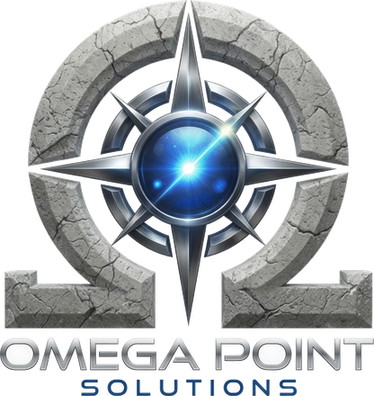
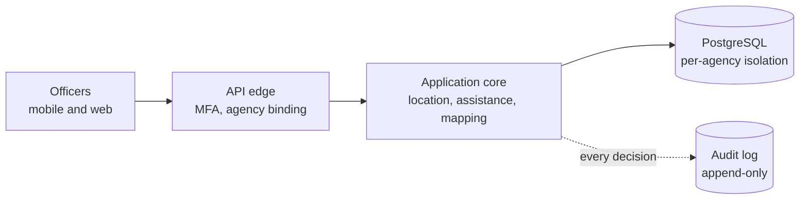

# OMEGA FIELD COMMAND

### Secure field operations and task force coordination for law enforcement.

**PROTECT. ENABLE. EMPOWER.**

**[Request a pilot](mailto:crose@omegapointsolutions.com?subject=Omega%20Field%20Command%20pilot)** · [Architecture](docs/architecture.md) · [Security posture](docs/security-posture.md) · [American made](docs/american-made.md)

A product of <b>Omega Point Solutions LLC</b> · Fraud Detection · Critical Infrastructure · Public Safety

---

## What it does

Field Command answers three questions an agency has to get right, and that ordinary tools get wrong quietly.

- **Where are my officers.** Stale is labeled stale. GPS off renders off. One render path, so nothing can show an old fix as current.
- **Who needs help, now.** One-tap assistance with per-recipient delivery state, acknowledgement, and a mandatory disposition on close.
- **Who actually got the call.** `delivered` is set only on a transport acknowledgement. Exhausted retries surface to the requesting officer as failed, by name.

Built for agencies and multi-agency task forces that need one operating picture without putting their data in a shared cloud tenant they cannot audit.

## Why it is different: evidence, not adjectives

Every vendor says secure. These are the claims we can hand you proof for.

**Agencies cannot see each other's data, and it is proven on every commit.**
Isolation is enforced by PostgreSQL row-level security, not by an application `WHERE` clause, so the database refuses even when the application is wrong. An automated test applies the real migrations to a live database and asserts that a cross-agency read returns nothing and an unbound session returns zero rows instead of every row. The build fails if that proof does not run.

**No other vendor's product code ships inside the platform, and a gate enforces it.**
The web framework, authentication, mapping, and geocoder are Omega Point original work on permissively licensed United States foundations. The production build adds exactly two registered dependencies. A build gate parses every module and fails on anything else.

**Officer safety is a correctness property, and the failure cases are the tests.**
Staleness, sharing state, and delivery status are enforced invariants, not display logic. The suite asserts the denials first: cross-agency access, stale shown as live, a supervisor force-enabling an officer's sharing, and a replayed one-time code.

**No certification is claimed.**
Controls are described as designed toward the relevant standards. We do not assert CJIS, SOC 2, or FedRAMP until an independent assessor validates it. We would rather lose a checkbox than put a claim in front of an agency that we cannot substantiate.

## Capabilities

| Area | Capability |
|---|---|
| **Location** | Owner-controlled sharing, computed staleness, offline map packages |
| **Assistance** | One-tap request, per-recipient delivery state, mandatory disposition |
| **Access control** | Role-based, evaluated per-request. Revocation lands on the next request |
| **Multi-agency** | Per-agency isolation at the database layer, scoped grants |
| **Accountability** | Append-only, hash-chained audit. Coordinates scrubbed before write |
| **Mapping** | In-house stack on United States public domain data |
| **Identity** | Mandatory multi-factor authentication, instant revocation, lockout |
| **Integrations** | Typed contracts. Every call carries actor and purpose |

## Architecture

Agency data stays on agency-owned infrastructure, or in a United States region of the agency's choosing, behind the agency's own reverse proxy. The platform never needs an outbound connection to a vendor cloud to work.

[Full architecture](docs/architecture.md) · [Security posture](docs/security-posture.md)

## Status

Phase 2 build. Identity, authorization, location, assistance, audit, and mapping are implemented and tested. Not yet released for production caseload, and no live agency data is in use.

Pilot slots are open now, and early agencies shape the roadmap.

## Contact

**Omega Point Solutions LLC**
[omegapointsolutions.com](https://omegapointsolutions.com) · [crose@omegapointsolutions.com](mailto:crose@omegapointsolutions.com)

**[Request a pilot](mailto:crose@omegapointsolutions.com?subject=Omega%20Field%20Command%20pilot)** for a technical walkthrough or procurement documentation.

---

© 2026 Omega Point Solutions LLC. All rights reserved. 
Documentation repository. The implementation is proprietary and maintained privately.

